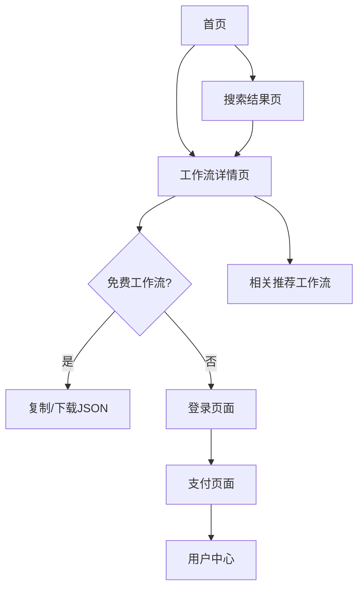

## 1. 产品概述
n8n工作流商店是一个专门展示和分享n8n自动化工作流的在线平台。用户可以浏览、搜索、复制各种实用的n8n工作流模板，部分高级工作流需要付费购买。平台旨在帮助n8n用户快速找到适合自己业务场景的自动化解决方案，提高工作效率。

目标用户群体包括：n8n用户、自动化爱好者、企业IT人员、开发者等需要工作流程自动化的专业人士。

## 2. 核心功能

### 2.1 用户角色
| 角色 | 注册方式 | 核心权限 |
|------|----------|----------|
| 访客用户 | 无需注册 | 浏览工作流、搜索、查看基础信息 |
| 登录用户 | Google SSO登录 | 复制免费工作流、购买付费工作流、管理个人中心 |
| 管理员 | 后台创建 | 上传工作流、管理工作流状态、用户管理 |

### 2.2 功能模块
我们的n8n工作流商店包含以下主要页面：
1. **首页**：工作流卡片展示、搜索栏、分类筛选、热门推荐
2. **工作流详情页**：工作流详细信息、JSON预览、复制/下载功能、购买按钮
3. **搜索结果页**：搜索结果展示、筛选排序
4. **用户中心**：个人资料、已购买的工作流、订单记录
5. **登录页面**：Google SSO登录入口

### 2.3 页面详情
| 页面名称 | 模块名称 | 功能描述 |
|----------|----------|----------|
| 首页 | 导航栏 | 网站logo、搜索框、登录按钮、用户头像下拉菜单 |
| 首页 | 工作流卡片网格 | 卡片式展示工作流缩略图、标题、描述、价格标签、使用次数 |
| 首页 | 分类筛选 | 按类别、难度、价格区间筛选工作流 |
| 首页 | 热门推荐 | 展示最受欢迎和使用频率最高的工作流 |
| 工作流详情页 | 工作流信息区 | 标题、描述、标签、作者信息、使用统计、价格显示 |
| 工作流详情页 | JSON预览区 | 可折叠的JSON代码预览，支持语法高亮 |
| 工作流详情页 | 操作按钮区 | 复制JSON按钮、下载文件按钮、购买按钮（付费工作流） |
| 工作流详情页 | 相关推荐 | 展示同类别的其他工作流 |
| 搜索结果页 | 搜索栏 | 关键词输入、搜索历史、搜索建议 |
| 搜索结果页 | 结果展示 | 搜索结果卡片列表、无结果提示 |
| 搜索结果页 | 筛选排序 | 按相关性、使用次数、发布时间排序 |
| 用户中心 | 个人资料 | 显示用户名、邮箱、注册时间 |
| 用户中心 | 我的工作流 | 已购买的付费工作流列表、使用记录 |
| 用户中心 | 订单记录 | 购买历史、订单状态、支付信息 |
| 登录页面 | Google登录 | Google SSO登录按钮、隐私政策链接 |

## 3. 核心流程

### 访客用户流程
访客用户访问网站 → 浏览工作流卡片 → 点击感兴趣的工作流 → 查看详情 → 如果是免费工作流可直接复制JSON → 如果是付费工作流提示登录 → 返回浏览其他工作流

### 登录用户流程
登录用户访问网站 → 浏览和搜索工作流 → 查看工作流详情 → 免费工作流可直接复制/下载 → 付费工作流点击购买 → 完成支付 → 获得访问权限 → 复制/下载工作流JSON

## 4. 用户界面设计

### 4.1 设计风格
- **主色调**：深蓝色(#1e40af)搭配白色背景，突出专业感
- **辅助色**：绿色(#10b981)表示成功状态，橙色(#f59e0b)表示付费内容
- **按钮样式**：圆角矩形设计，主要操作为实心按钮，次要操作为边框按钮
- **字体**：系统默认字体，标题使用加粗，正文字号14-16px
- **布局风格**：卡片式网格布局，响应式设计，支持多列展示
- **图标风格**：使用简洁的线性图标，突出功能性

### 4.2 页面设计概述
| 页面名称 | 模块名称 | UI元素 |
|----------|----------|--------|
| 首页 | 工作流卡片 | 白色卡片带阴影悬停效果，显示工作流缩略图、标题、简短描述、价格标签，卡片点击区域完整 |
| 工作流详情页 | JSON预览 | 深色代码编辑器样式，支持语法高亮，可展开折叠，显示行号 |
| 工作流详情页 | 操作按钮 | 主要按钮为蓝色实心，次要按钮为边框样式，按钮大小适中便于点击 |
| 搜索结果页 | 筛选器 | 下拉选择框样式，选中状态显示蓝色边框 |
| 用户中心 | 信息卡片 | 简洁的白色卡片，信息分组清晰，使用图标辅助识别 |

### 4.3 响应式设计
- **桌面优先**：优先设计桌面端体验，支持大屏幕多列展示
- **移动端适配**：平板端2列展示，手机端单列展示
- **触摸优化**：按钮和可点击区域大小适配触摸操作
- **断点设置**：768px（平板）、1024px（小屏桌面）、1280px（大屏桌面）

## 5. 技术要求

### 5.1 性能要求
- 页面加载时间 < 3秒
- 搜索响应时间 < 500ms
- 支持并发用户 > 1000人
- 图片懒加载优化

### 5.2 SEO优化
- 服务端渲染(SSR)支持
- 页面meta标签优化
- 结构化数据标记
- XML网站地图
- 友好的URL结构

### 5.3 安全要求
- HTTPS加密传输
- 用户数据加密存储
- 支付信息安全处理
- 防止XSS和SQL注入

## 6. 成功指标

### 6.1 用户指标
- 月活跃用户数 > 5000人
- 用户平均停留时间 > 5分钟
- 注册用户转化率 > 10%
- 付费转化率 > 3%

### 6.2 内容指标
- 工作流总数 > 500个
- 免费工作流占比 > 70%
- 平均每个工作流被复制次数 > 50次
- 用户满意度 > 4.5/5.0

### 6.3 技术指标
- 网站可用性 > 99.9%
- 页面加载速度 < 3秒
- 搜索准确率 > 90%
- 移动端兼容性 > 95%