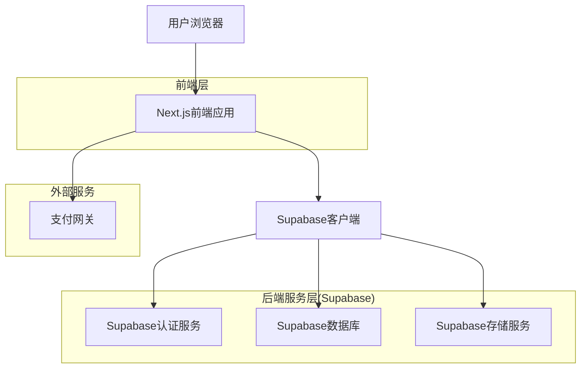
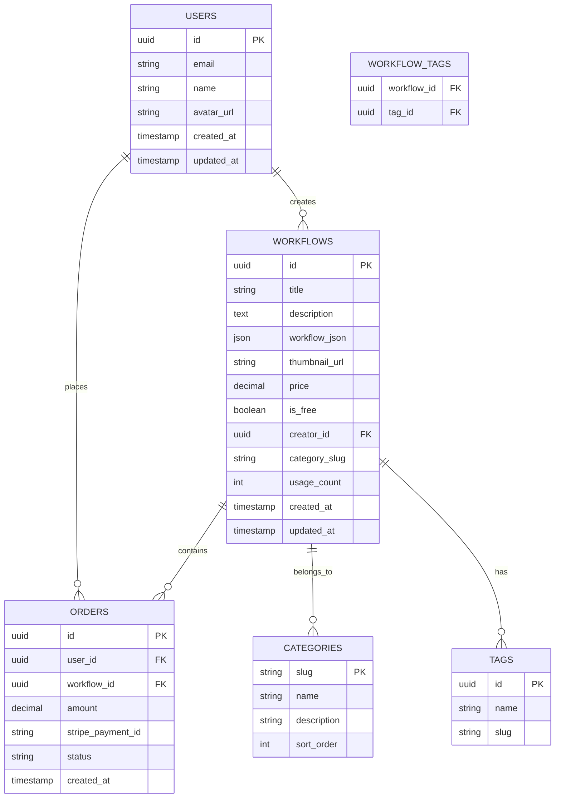

## 1. 架构设计



## 2. 技术栈描述

- **前端**: Next.js@14 + React@18 + TypeScript + Tailwind CSS
- **后端**: Supabase (内置认证、PostgreSQL数据库、对象存储)
- **支付**: Stripe 支付集成
- **部署**: Vercel (支持边缘函数和SSR)
- **SEO**: Next.js内置SEO优化功能

## 3. 路由定义

| 路由 | 用途 |
|------|------|
| / | 首页，展示工作流卡片列表 |
| /workflow/[id] | 工作流详情页面 |
| /search | 搜索结果页面 |
| /category/[slug] | 分类页面 |
| /auth/login | 用户登录页面 |
| /user/profile | 用户个人中心 |
| /user/workflows | 用户已购买的工作流 |
| /user/orders | 用户订单历史 |
| /api/webhook/stripe | Stripe支付回调接口 |

## 4. 数据库模型

### 4.1 数据模型定义



### 4.2 数据定义语言

用户表 (users)
```sql
CREATE TABLE users (
  id UUID PRIMARY KEY DEFAULT gen_random_uuid(),
  email VARCHAR(255) UNIQUE NOT NULL,
  name VARCHAR(100) NOT NULL,
  avatar_url TEXT,
  created_at TIMESTAMP WITH TIME ZONE DEFAULT NOW(),
  updated_at TIMESTAMP WITH TIME ZONE DEFAULT NOW()
);

-- 启用行级安全
ALTER TABLE users ENABLE ROW LEVEL SECURITY;

-- 创建策略
CREATE POLICY "用户只能查看自己的资料" ON users
  FOR SELECT USING (auth.uid() = id);

CREATE POLICY "用户可以更新自己的资料" ON users
  FOR UPDATE USING (auth.uid() = id);
```

工作流表 (workflows)
```sql
CREATE TABLE workflows (
  id UUID PRIMARY KEY DEFAULT gen_random_uuid(),
  title VARCHAR(200) NOT NULL,
  description TEXT,
  workflow_json JSONB NOT NULL,
  thumbnail_url TEXT,
  price DECIMAL(10,2) DEFAULT 0.00,
  is_free BOOLEAN DEFAULT true,
  creator_id UUID REFERENCES users(id),
  category_slug VARCHAR(50),
  usage_count INTEGER DEFAULT 0,
  created_at TIMESTAMP WITH TIME ZONE DEFAULT NOW(),
  updated_at TIMESTAMP WITH TIME ZONE DEFAULT NOW()
);

-- 创建索引
CREATE INDEX idx_workflows_category ON workflows(category_slug);
CREATE INDEX idx_workflows_free ON workflows(is_free);
CREATE INDEX idx_workflows_usage ON workflows(usage_count DESC);
CREATE INDEX idx_workflows_created ON workflows(created_at DESC);

-- 启用行级安全
ALTER TABLE workflows ENABLE ROW LEVEL SECURITY;

-- 创建访问策略
CREATE POLICY "任何人都可以查看工作流" ON workflows
  FOR SELECT USING (true);

CREATE POLICY "只有创建者可以更新工作流" ON workflows
  FOR UPDATE USING (auth.uid() = creator_id);

CREATE POLICY "只有创建者可以删除工作流" ON workflows
  FOR DELETE USING (auth.uid() = creator_id);
```

订单表 (orders)
```sql
CREATE TABLE orders (
  id UUID PRIMARY KEY DEFAULT gen_random_uuid(),
  user_id UUID REFERENCES users(id) NOT NULL,
  workflow_id UUID REFERENCES workflows(id) NOT NULL,
  amount DECIMAL(10,2) NOT NULL,
  stripe_payment_id VARCHAR(100),
  status VARCHAR(20) DEFAULT 'pending',
  created_at TIMESTAMP WITH TIME ZONE DEFAULT NOW(),
  updated_at TIMESTAMP WITH TIME ZONE DEFAULT NOW(),
  UNIQUE(user_id, workflow_id)
);

-- 创建索引
CREATE INDEX idx_orders_user ON orders(user_id);
CREATE INDEX idx_orders_workflow ON orders(workflow_id);
CREATE INDEX idx_orders_status ON orders(status);

-- 启用行级安全
ALTER TABLE orders ENABLE ROW LEVEL SECURITY;

-- 创建访问策略
CREATE POLICY "用户只能查看自己的订单" ON orders
  FOR SELECT USING (auth.uid() = user_id);

CREATE POLICY "认证用户可以创建订单" ON orders
  FOR INSERT WITH CHECK (auth.uid() = user_id);
```

分类表 (categories)
```sql
CREATE TABLE categories (
  slug VARCHAR(50) PRIMARY KEY,
  name VARCHAR(100) NOT NULL,
  description TEXT,
  sort_order INTEGER DEFAULT 0
);

-- 插入初始数据
INSERT INTO categories (slug, name, description, sort_order) VALUES
('automation', '自动化', '各种自动化流程模板', 1),
('integration', '集成', '第三方服务集成模板', 2),
('data-processing', '数据处理', '数据转换和处理模板', 3),
('notification', '通知', '消息通知相关模板', 4),
('social-media', '社交媒体', '社交媒体自动化模板', 5);
```

## 5. API接口定义

### 5.1 工作流相关API

获取工作流列表
```
GET /api/workflows
```

请求参数：
| 参数名 | 类型 | 必需 | 描述 |
|--------|------|------|------|
| page | number | 否 | 页码，默认1 |
| limit | number | 否 | 每页数量，默认20 |
| category | string | 否 | 分类筛选 |
| is_free | boolean | 否 | 是否免费筛选 |
| search | string | 否 | 搜索关键词 |

响应：
```json
{
  "data": [
    {
      "id": "uuid",
      "title": "工作流标题",
      "description": "工作流描述",
      "thumbnail_url": "https://...",
      "price": 9.99,
      "is_free": true,
      "usage_count": 125,
      "created_at": "2024-01-01T00:00:00Z"
    }
  ],
  "total": 100,
  "page": 1,
  "limit": 20
}
```

获取工作流详情
```
GET /api/workflows/{id}
```

响应：
```json
{
  "id": "uuid",
  "title": "工作流标题",
  "description": "工作流描述",
  "workflow_json": {...},
  "thumbnail_url": "https://...",
  "price": 9.99,
  "is_free": true,
  "category_slug": "automation",
  "usage_count": 125,
  "creator": {
    "id": "uuid",
    "name": "创建者名称"
  },
  "has_access": true
}
```

### 5.2 订单相关API

创建工作流订单
```
POST /api/orders
```

请求：
```json
{
  "workflow_id": "uuid"
}
```

响应：
```json
{
  "order_id": "uuid",
  "stripe_session_id": "cs_test_...",
  "amount": 9.99
}
```

## 6. 权限控制

### 6.1 Supabase RLS策略

工作流访问权限
```sql
-- 免费工作流：任何人都可以访问
CREATE POLICY "免费工作流可访问" ON workflows
  FOR SELECT USING (is_free = true);

-- 付费工作流：只有购买用户可以访问
CREATE POLICY "付费工作流需购买" ON workflows
  FOR SELECT USING (
    is_free = false AND 
    EXISTS (
      SELECT 1 FROM orders 
      WHERE orders.workflow_id = workflows.id 
      AND orders.user_id = auth.uid() 
      AND orders.status = 'completed'
    )
  );
```

## 7. 部署配置

### 7.1 环境变量
```env
# Supabase
NEXT_PUBLIC_SUPABASE_URL=your_supabase_url
NEXT_PUBLIC_SUPABASE_ANON_KEY=your_supabase_anon_key
SUPABASE_SERVICE_ROLE_KEY=your_service_role_key

# Stripe
NEXT_PUBLIC_STRIPE_PUBLISHABLE_KEY=your_stripe_publishable_key
STRIPE_SECRET_KEY=your_stripe_secret_key
STRIPE_WEBHOOK_SECRET=your_stripe_webhook_secret

# Google OAuth
GOOGLE_CLIENT_ID=your_google_client_id
GOOGLE_CLIENT_SECRET=your_google_client_secret

# App
NEXT_PUBLIC_SITE_URL=https://your-domain.com
```

### 7.2 Vercel配置
```json
{
  "functions": {
    "app/api/webhooks/stripe/route.ts": {
      "maxDuration": 30
    }
  },
  "images": {
    "domains": ["your-supabase-storage-domain.com"]
  }
}
```

## 8. 性能优化

### 8.1 缓存策略
- 工作流列表数据缓存5分钟
- 热门工作流缓存15分钟
- 用户会话缓存1小时
- CDN缓存静态资源24小时

### 8.2 数据库优化
- 为常用查询字段创建索引
- 使用JSONB类型存储工作流JSON数据
- 定期清理过期会话数据
- 使用数据库连接池

### 8.3 前端优化
- 图片懒加载和WebP格式
- 代码分割和按需加载
- 使用React.memo优化组件渲染
- 实现虚拟滚动处理大量